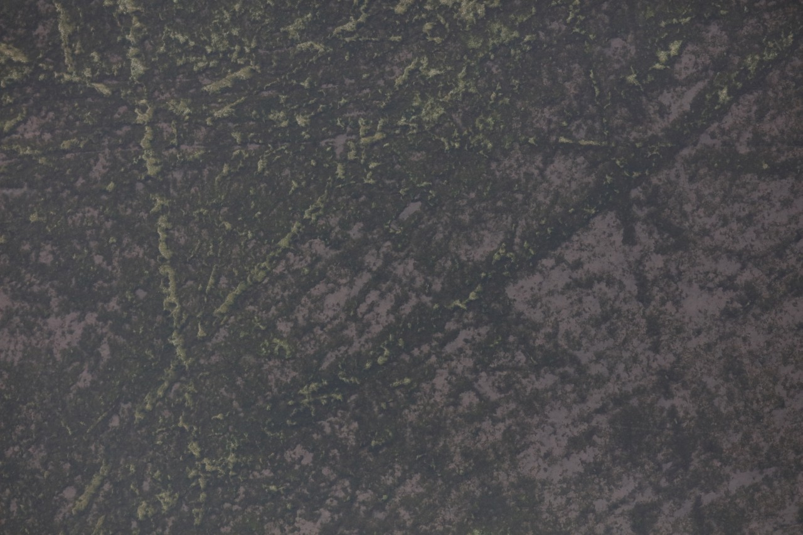
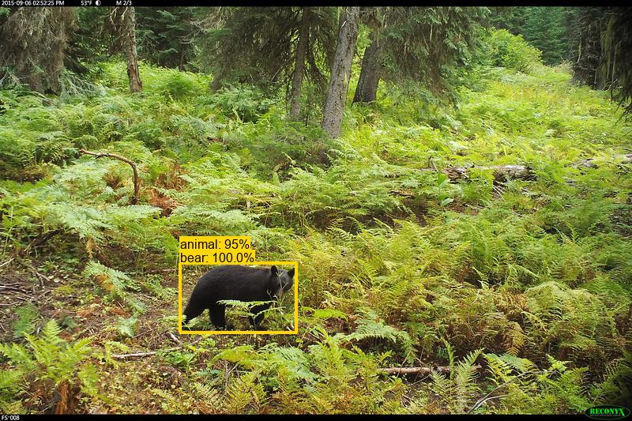

# Using computer vision for urban forestry and wildlife monitoring

...aka, "a bunch of links I like talking about that I'm going to share via an avant-garde no-slides presentation".

## What we work on

The Google AI for Nature and Society program (part of Google's [AI for Social Good](https://ai.google/responsibility/social-good/) program) uses AI &ndash; especially computer vision &ndash; to help conservation folks spend less time doing boring things, and more time doing conservation.

If anywhere in this talk I tell you that AI can <i>automate</i> anything, I owe you a granola bar, because it can't, but AI can already dramatically <i>accelerate</i> tedious data review tasks in lots of domains, three of which we'll talk about today.

## Some projects I'm <i>not</i> talking about today

...because my collaborators are going to give WILDLABS talk soon, right?  Eh?  Nudge, nudge.  I won't call you out by name.  But Steph might.  No promises.

### [Perch](https://github.com/google-research/perch) ([blog post](https://blog.google/intl/en-au/company-news/technology/ai-ecoacoustics/)) ([video with very dramatic music](https://www.youtube.com/watch?v=hxk1zpLiGn4))

   Gratuitous pretty spectrogram from <a href="https://patternradio.withgoogle.com">patternradio.withgoogle.com</a>.
  
### [Wildlife Insights](https://www.wildlifeinsights.org/) ([WILDLABS talk about Wildlife Insights from a zillion years ago](https://wildlabs.net/event/how-do-i-get-started-wildlife-insights))

   A deer.  In a box.  But not a real box, a virtual box.

## Some projects I <i>am</i> talking about today

### Google Environmental Insights Explorer Tree Canopy

 <i>Google Environmental Insights Explorer Tree Canopy page for <a href="https://insights.sustainability.google/places/ChIJQWCmo89rkFQRZQfQ6oJUz7o/trees?ty=2022&hl=en-US">Bellevue, WA</a> </i>

### Finding geese in aerial images ([GitHub repo](https://github.com/agentmorris/usgs-geese))

 <i>Image credit: USGS, from the [Izembek Lagoon Waterfowl](https://lila.science/datasets/izembek-lagoon-waterfowl/) dataset</i>

### Camera trap stuff, especially updates on [MegaDetector](https://github.com/agentmorris/MegaDetector/) and [LILA](https://lila.science)

 <i>Image credit: [Saola Working Group](https://www.savethesaola.org/), from the [SWG Camera Traps](https://lila.science/datasets/swg-camera-traps) dataset</i>

## Accelerating urban forestry surveys with AI

### Let's talk about trees!

"But wait", you're asking, "Dan only ever talks about pictures of animals (like, <i>all</i> the time... <i>we get it</i>, you're into pictures of animals), why are we talking about pictures of trees?"

* Urban trees provide shade (and it's getting very hot in cities)
* Urban trees provide shade (this is so important that I'm writing it twice)
* Urban trees filter stormwater (in the both the chemical sense of "filtering out molecules from a soup of other molecules" and the engineering-geeky "low-pass filter" sense)
* Urban trees provide habitat for urban and migratory wildlife
* Urban trees sequester carbon
* But also... shade.

### OK, I like trees too, but what does this have to do with AI?

* Understanding where tree canopy is adequate/inadequate in urban environments can help allocate resources for tree planting and protection
* But understanding where tree canopy is adequate/inadequate in urban environments is an expensive proposition; it usually requires some combination of bespoke overhead imagery and tedious review of that imagery
* AI can't automate this, but the combination of existing imagery and AI can help cities get started, and can (hopefully) reduce the time/cost of canopy assessments

### Google EIE Tree Canopy

* Google has lots of high-res imagery of cities (what you see in Google Maps)
* Google does lots of AI, including finding trees in aerial imagery with AI (credit lots of other people, way before my time at Google)
* Google folks figured that since we're already finding trees, maybe we can help cities estimate urban canopy (still credit lots of other people, still way before my time at Google)
* Making a long story short, now you can find tree canopy estimates for lots of cities within [Environmental Insights Explorer](https://insights.sustainability.google/)

"OK", you're thinking, "having a tree canopy number is great, but how does this get put to work to help cities with tree planning?"  Great question, inquisitive strawperson I just invented. I'll tell you!

### Ways we put our tree canopy data to work

#### The EIE app

For example...

<i>EIE Tree Canopy page for Zurich ([direct link](https://insights.sustainability.google/places/ChIJGaK-SZcLkEcRA9wf5_GNbuY/trees?hl=en-US))</i>

 <i>EIE Tree Canopy page for Mexico City ([direct link](https://insights.sustainability.google/places/ChIJB3UJ2yYAzoURQeheJnYQBlQ/trees?hl=en-US))</i>

 <i>EIE Tree Canopy page for Seattle ([direct link](https://insights.sustainability.google/places/ChIJVTPokywQkFQRmtVEaUZlJRA/trees?ty=2022&hl=en-US))</i>

#### Direct data delivery to cities (or counties, parks departments, etc.)

E.g., high-res tree data for Edinburgh viewed in Earth Engine:

And the same high-res tree data for Edinburgh viewed in QGIS:

And on a personal note, this is my version of "travel"!  I'm always apologizing to my WILDLABS friends for the fact that I never go anywhere, but this is my travel: every couple weeks I check which cities have requested data, and I get to "visit" those cities, and I especially get to pick landmarks to include as screenshots when I send data to cities (always including NFL stadiums in the US and soccer stadiums in Europe if I can).  Geospatial ML is fun!

#### Sharing data with impact partners

E.g., we shared data with [American Forests](https://americanforests.org/) to support their [Tree Equity Score](https://treeequityscore.org/) platform... you should all read their whole Web page; their work and their platform are amazing.  But I only have time to give it one screenshot, showing estimated canopy cover, along with socioeconomic information and heat risk information, for one census block group ([direct link](https://www.treeequityscore.org/map#10/29.7655/-95.3787)):

A bunch of other impact partnerships like this are in progress, e.g. our tree-friends at <a href="https://www.treeconomics.co.uk/">Treeconomics</a> have been fantastic early adopters of this data in the UK.

### Tree-related CTA

If you work with urban foresters or city planners who might benefit from this data, encourage them to click that link and request data, even if their data doesn't currently appear in the EIE app.

### Also see...

* Sara's (and others') awesome work on the [Auto Arborist dataset](https://google.github.io/auto-arborist/), which aims to go beyond canopy cover and into taxonomic classification
* [American Forests press release](https://www.americanforests.org/article/american-forests-unveils-updates-for-tree-equity-score-tool-to-address-climate-justice/) about the Tree Equity Score platform
* Google blog posts about this work ([1](https://blog.google/outreach-initiatives/sustainability/google-ai-climate-change-solutions/), [2](https://blog.google/outreach-initiatives/sustainability/extreme-heat-support/), [3](https://blog.google/products/maps/how-5-cities-plan-use-tree-canopy-fight-climate-change/), [4](https://blog.google/products/earth/helping-cities-seed-new-trees-with-tree-canopy-lab/), [5](https://about.google/stories/tree-canopy-coverage-solutions/))

## Accelerating aerial wildlife surveys with AI

Actually specifically accelerating surveys of just one specific goose, but with a nod to the much larger ecosystem of work in this area.

### Background: Izembek brant survey

This is a [brant goose](https://en.wikipedia.org/wiki/Brant_(goose)):

&nbsp;&nbsp;&nbsp;&nbsp;&nbsp; &nbsp;&nbsp;&nbsp;&nbsp;&nbsp;<i>Image credit: U.S. Fish and Wildlife Service</i>

This is a plane:

&nbsp;&nbsp;&nbsp;&nbsp;&nbsp;

(You can't prove there's <i>not</i> a high-resolution camera on the bottom of that plane.)

This is one of ~130,000 high-res aerial images that USGS has captured ~annually to survey this population in and around [Izembek Lagoon](https://www.fws.gov/refuge/izembek) in Alaska:

&nbsp;&nbsp;&nbsp;&nbsp;&nbsp; &nbsp;&nbsp;&nbsp;&nbsp;&nbsp;<i>Image credit: USGS, from the <a href="https://alaska.usgs.gov/products/data.php?dataid=484">Fall Waterfowl Surveys, Izembek Lagoon dataset</i></a>

This is one of the ~95% of those images that don't contain any birds:

&nbsp;&nbsp;&nbsp;&nbsp;&nbsp; &nbsp;&nbsp;&nbsp;&nbsp;&nbsp;<i>Image credit: USGS, from the <a href="https://alaska.usgs.gov/products/data.php?dataid=484">Fall Waterfowl Surveys, Izembek Lagoon dataset</i></a>

This one has four different species in it:

&nbsp;&nbsp;&nbsp;&nbsp;&nbsp; &nbsp;&nbsp;&nbsp;&nbsp;&nbsp;<i>Image credit: USGS, from the <a href="https://alaska.usgs.gov/products/data.php?dataid=484">Fall Waterfowl Surveys, Izembek Lagoon dataset</i></a>
 
No, really, it does:

&nbsp;&nbsp;&nbsp;&nbsp;&nbsp; &nbsp;&nbsp;&nbsp;&nbsp;&nbsp;<i>Image credit: USGS, from the <a href="https://alaska.usgs.gov/products/data.php?dataid=484">Fall Waterfowl Surveys, Izembek Lagoon dataset</i></a>

<b>Around 100k brant are imaged each year, plus another ~25k of other species.  Would you like to count all those birds?  I'll give you a granola bar if you'll count all those birds.</b>

### Once in a while, in ML, if you find enough four-leaf clovers and hang enough dreamcatchers...

...a dataset magically lands on your desk that is a total unicorn: huge, well-annotated, and still useful, just waiting for someone to, in formal mathematical terms, "AI the *&#$ out of it".

For me, that was this dataset!  I somehow found myself in touch with [Emily](https://www.linkedin.com/in/emily-weiser-431888257/) from USGS, who had done an amazing job leading the curation of a [huge dataset](https://alaska.usgs.gov/products/data.php?dataid=484), with the help of a general-purpose no-code AI tool ([CountThings](https://countthings.com/)) that served as bootstrapping for this project.  (Lots more information about that dataset in their [2022 paper](https://wildlife.onlinelibrary.wiley.com/doi/full/10.1002/wsb.1407)).

### So we trained a model...

...to find the species that are relevant to this survey:

* Brant (424,790 training points)
* Canada goose (47,561 training points)
* Gull (5,631 training points)
* Emperor goose (2,013 training points)
* Other (5,631 training points)

### The model is pretty vanilla...

...so I'm not going to tell you about fancy deep learning architectures.  The high bits are:

* YOLOv5x6, trained using default hyperparameters for 200 epochs
* Labels are just points, not boxes, so we just assumed every bird is 50x50 pixels (not ideal, but we have lots of training points, and it is what it is)
* Trained on 1280x1280 patches (cropped from 8688x5792 images), non-overlapping
* At inference time, we still use 1280x1280 patches, but with 10% overlap, then do NMS for each (big) image to get rid of redundant boxes
* We use YOLOv5's [test-time augmentation](https://docs.ultralytics.com/yolov5/tutorials/test_time_augmentation/) during inference, because it's magical (more on this later)
* 85/15 train/val split for the final model (we have previously-unlabeled 2022 data to use as legit test data, as well as some 2017-2019 images that only have counts, not points, which are great test data, because the application really only cares about counts)

Patches look like this, this is the atom of both training and inference:

### Results

No, actually, just one result, this is a lightning talk... the result is "the ecologists are happy with the count-level agreement and aren't going to count 100,000 birds every year any more".  Huzzah.

Importantly: they will still count <i>some</i> birds every year to keep an eye out for domain shift.

### Code and data

* [Code](https://github.com/agentmorris/usgs-geese) (including model weights)
* [Data](https://lila.science/datasets/izembek-lagoon-waterfowl/) (re-formatted and re-hosted on LILA, to make it a little easier for the next person)
* ...and speaking of "the next person"... there's lots left to do, so I beta-tested the approach of asking for volunteers on the AI for Conservation Slack, and [Giacomo](https://people.epfl.ch/giacomo.may) has taken the baton.

### This project is just... one bird in a flock?

The field of AI for aerial and drone wildlife surveys is at the same inflection point that AI for camera traps was in ~2018.  Data is out there, models are out there, papers are out there.  Lots of folks are rallying this community toward global models (like Ben Weinstein et al's [global bird detector](https://esajournals.onlinelibrary.wiley.com/doi/abs/10.1002/eap.2694)) and global datasets.

So, a group of volunteers gathered on the AI for Conservation Slack for a quick-and-dirty community effort to collect structured metadata and consistent sample code for all the public datasets with pictures of animals taken from planes and drones.  The hope is that folks starting new projects can quickly look for images that match the gestalt of their images, so model-training doesn't have to start totally from scratch.

* [Datasets with annotated wildlife in drone/aerial images](https://github.com/agentmorris/agentmorrispublic/blob/main/drone-datasets.md)
* Sidebar... this community effort was fun!
* Double-sidebar... someone should do this for marine video, also maybe at a similar inflection point!

## MegaDetector updates

Aka "you released a model... now what?"

### MegaWhat?

[MegaDetector](https://github.com/agentmorris/MegaDetector) is an object detection model that finds animals, people, and vehicles in camera trap images, like this: 

&nbsp;&nbsp;&nbsp;&nbsp;&nbsp;&nbsp; &nbsp;&nbsp;&nbsp;&nbsp;&nbsp;&nbsp;<i>Image credit: University of Minnesota, from the <a href="https://lila.science/datasets/orinoquia-camera-traps/">Orinoquía Camera Traps</a> dataset</i> 

In practice it's mostly used to classify images as animal/person/vehicle/empty.

### A history of MegaDetector in four lines

* v2 (2018): animals only, public data only, primarily iterating on workflow and assessing generalizability.
* v3 (2019): added a “person” class, broadened species/ecosystems coverage.
* v4 (2020): added a “vehicle” class, added humans from anti-poaching cameras. Emphasized dense rainforests. 
* v5 (2021): Targeted weak spots: bait posts, traps, unusual camera angles.  Adding trains to the “vehicle” class.

Find more details about the training data for each version [here](https://github.com/agentmorris/MegaDetector/blob/main/megadetector.md#can-you-share-the-training-data).

NB: Every version of MegaDetector was trained at Microsoft (first by [Sara](https://beerys.github.io/), then by [Siyu](https://www.linkedin.com/in/yangsiyu007/)).  Huuuuuuuuuuuuge credit to Microsoft for the existence of MegaDetector.

### But the Internet says someone already talked about MegaDetector at a WILDLABS event, why are we here?

That's correct!  [Siyu](https://www.linkedin.com/in/yangsiyu007/) presented MDv4 shortly after its release at a [WILDLABS tech tutors event](https://www.youtube.com/watch?v=LUkQVARAVFI&ab_channel=WILDLABS.NET).  I will repeat zero of those details today.  Instead, today we'll quickly summarize what's been going on in MegaDetector-land since then.

### MDv5 release

The biggest news in MegaDetector-land since Siyu presented 1.0 pandemics ago is the release of [MDv5](https://github.com/agentmorris/MegaDetector/releases/tag/v5.0).

* YOLOv5x6 (the heaviest in the YOLOv5 family, 1280px input size)
* 3x-4x faster than MDv4 (25k-50k images per day with no GPU, 250k-1M images per day on a typical-ish GPU)
* New training data focused on problem areas for MDv4, especially human-made objects and quirky camera angles

E.g. this kind of thing was often difficult for MDv4, where an animal frequently overlapped a human-made object:

&nbsp;&nbsp;&nbsp;&nbsp;&nbsp;&nbsp; 
&nbsp;&nbsp;&nbsp;&nbsp;&nbsp;&nbsp;<i>Image credit: USGS Fort Collins Science Center</i>

Adoption really took off, in large part because of the speed difference; huge credit to Siyu for being totally right when I was totally wrong about switching to YOLOv5.  MD is now in use by hundreds of organizations; we list many of them [here](https://github.com/agentmorris/MegaDetector#who-is-using-megadetector).  (If you're using MD, and you're not on that list, but you're willing to be, [email us](mailto:cameratraps@lila.science)!)

### It takes a village!

An AI model is nifty, but no ecologist has ever asked for a model weights file for their birthday.  MegaDetector owes its adoption to the community that sprung up to put those models to work in all kinds of platforms/environments, and MD would just be a pile of bits were it not for collaborations with...

#### <a href="https://saul.cpsc.ucalgary.ca/timelapse/pmwiki.php?n=Main.HomePage">Timelapse</a>

#### <a href="https://github.com/PetervanLunteren/EcoAssist">EcoAssist</a>

 

 

 

Look at all those EcoAssist users!

#### <a href="https://github.com/bencevans/camtrap-detector">CamTrap Detector</a>

That's right, just drag and drop!

#### <a href="https://wildlifeinsights.org">Wildlife Insights</a>

Full disclosure: WI is using a [derivative of MegaDetector](https://groups.google.com/g/wildlifeinsights/c/Ad4sre_lut0), but I'm sure one of my WI colleagues is going to update you on that when they present at a future WILDLABS event.  Nudge, nudge, nudge again.

#### <a href="https://animl.camera/">Animl</a>

#### (Also) <a href="https://github.com/conservationtechlab/animl">Animl</a>

&nbsp;&nbsp;&nbsp;&nbsp;

Showing some love for the 99% of our users that speak R!

#### <a href="https://wildtrax.ca/">WildTrax</a>

Also using MegaClassifier!  (Yes, that's a thing.)

#### <a href="https://wildlifeprotectionsolutions.org/wpswatch/">wpsWatch</a>

#### <a href="https://wildeyeconservation.org/traptagger/">TrapTagger</a>

#### <a href="https://agouti.eu">Agouti</a>

#### <a href="https://www.zambacloud.com/">Zamba Cloud</a> (still images get all the attention, but video is happening!)

Their <a href="https://zamba.drivendata.org/docs/v2.3/api-reference/object-detection-megadetector_lite_yolox/">MegaDetector Lite</a> model adapts MD to <a href="https://github.com/Megvii-BaseDetection/YOLOX">YOLOX</a>, because it turns out, videos are really <i>lots</i> of images, and MD is... not the fastest model ever.

#### And lots of others...

...and lots of others that are actually out there putting AI tools into their users' hands.

### But in the little part of the village where I live...

#### Making MD work better ("improving" doesn't always mean "re-training")

We've been tracking some scenarios where MD struggles [here](https://github.com/agentmorris/MegaDetector/blob/main/megadetector-challenges.md)... especially reptiles, unusual camera angles, and random bizarre-o-world AI failures.  So what are we doing about them?

* Improving our <a href="https://github.com/agentmorris/MegaDetector/tree/main/api/batch_processing/postprocessing/repeat_detection_elimination">repeat detection elimination</a> tools: getting rid of (some) rocks and sticks

  If the same detection happens seventy-gazillion times in a row, it's probably not really an animal, so we can probably look at just one example and remove all seventy-gazillion detections:
  
   
  <i>Image credit: Idaho Department of Fish & Game, from the <a href="https://lila.science/datasets/idaho-camera-traps/">Idaho Camera Traps</a> dataset</i>
  
  But <i>sometimes</i> it's just a sleeping elk:
  
   
  <i>Image credit: Idaho Department of Fish & Game, from the <a href="https://lila.science/datasets/idaho-camera-traps/">Idaho Camera Traps</a> dataset</i>
  
  ...so this is a semi-automated process, but we've added some bells and whistles to make it as fast as possible.

* Support for YOLOv5's [test-time augmentation](https://docs.ultralytics.com/yolov5/tutorials/test_time_augmentation/)

   
  <i>Image credit: University of Idaho</i>
  
  TTA is as close to a free lunch as you'll find in ML, it just costs inference time, and magically &ndash; in technical terms &ndash; Stuff Works Better.  E.g. that image isn't random; "stock MegaDetector" finds most of these grouse, but misses more than we'd like, and it looks like (fingers crossed!) the combination of RDE and TTA is enough to be the difference between "this user looking at three million images the old-fashioned way" and "this user benefiting from AI".

* Fine-tuning MegaDetector (not just in the last-layer sense of "fine-tuning")

   
  <i>Image credit: USGS Fort Collins Science Center</i>
  
  In these cases we hope to get a detector that works better on the species of interest, and probably worse on everything else (no free lunch this time), but that's OK, because in most cases it will be fine to run MD <i>and</i> MD-special-whatever-version.
  
  This image is also not chosen at random; MegaDetector struggles on reptiles (because they're under-represented in training, not because they're inherently difficult), and this dataset is our first test case of fine-tuning our way around this problem.  Results are very promising... stay tuned!
  

#### Other random infrastructure stuff

* Somewhat-less-terrible support for video:

  

  (Would anyone care to guess what percentage of my prep time for this talk was spent unsuccessfully trying to embed this video into GitHub markdown?)

  My best estimate is that videos are now around 10% of MegaDetector use.  We still don't do anything "clever" with videos, but the basic tasks of running MD on frames and doing reasonable things with the results have gotten a lot closer to being ready for prime time.  See [this notebook](https://github.com/agentmorris/MegaDetector/blob/main/api/batch_processing/data_preparation/manage_video_batch.ipynb) to get the gist of how we process videos.  Video results from MD now play nicely with Timelapse and with the other postprocessing scripts in our repo.

* Mac M1/M2 (Apple silicon) support

* Migration of recommended environment from Anaconda to Mamba

* Experimental [support](https://github.com/agentmorris/MegaDetector/blob/main/detection/run_tiled_inference.py) for chopping high-res images into tiles, running MD, and re-assembling the results, to help with Very Small Things (especially far-away ungulates and not-so-far-away rodents)

* pip-installability via the <a href="https://pypi.org/project/megadetector/">megadetector</a> Python package (NB: this is still not how we recommend using MD... but it exists and isn't totally silly)

#### MegaClassifier

There's a very small chance I'm actually getting to this topic in a 15-minute talk, but for posterity, MegaClassifier is a thing:

&nbsp;&nbsp;&nbsp;&nbsp;&nbsp; 
&nbsp;&nbsp;&nbsp;&nbsp;&nbsp; 
&nbsp;&nbsp;&nbsp;&nbsp;&nbsp; 
&nbsp;&nbsp;&nbsp;&nbsp;&nbsp; 
&nbsp;&nbsp;&nbsp;&nbsp;&nbsp;<i>I suppose a baby moose <u>is</u> like 80% of a moose!</i>  

Those images are absolutely hand-picked, take them with a grain of salt. MegaClassifier was an early effort to test the idea of training classifiers on MegaDetector crops, and at the same time to test the idea of combining a global-ish classifier with ecosystem-specific output category mappings.  It hasn't been developed since 2020, but because <a href="https://chrisyeh96.github.io/">Chris</a> wrote amazing code, MegaClassifier continues to be useful way past its expected lifetime, e.g. [WildTrax](https://www.wildtrax.ca/) just recently [added MegaClassifier](https://abmi.ca/home/news-events/events/New-WildTrax-Release) to their platform.  MegaClassifier also plays nicely with Timelapse:

Chris also recently posted instructions for [using MegaClassifier as a feature extractor](https://github.com/agentmorris/MegaDetector/tree/main/classification#use-a-trained-classifier-as-a-feature-extractor), so hopefully this will help other folks train new classifiers with limited training data.  

MegaClassifier has never been evaluated as deeply as MegaDetector, so although we can the weights, we don't broadly distribute them.  [Email us](mailto:cameratraps@lila.science) to learn more.

We may or may not have gone down this whole path just so we could name something "MegaClassifier".

### MegaDetector-related CTAs

* [Tell us](mailto:cameratraps@lila.science) if you're using MegaDetector!
* If you tried MegaDetector, and it was a catastrophe, [also tell us](mailto:cameratraps@lila.science)!
* If you haven't tried MegaDetector, and you're working with camera trap images, try it, either via [our command line instructions](https://github.com/agentmorris/MegaDetector/blob/main/megadetector.md#using-the-model) or via any of the tools above that run MD.
* [Contribute](https://github.com/agentmorris/MegaDetector/issues/84) to MegaDetector!  And not just directly to MD, there's also a list at the bottom of that link to some of the other projects I mentioned above, which are
 almost all also open-source.  In fact, forget that link, just head over to the WILDLABS [Camera Traps](https://wildlabs.net/groups/camera-traps) discussion group, and say you want to help.
* Make data publicly available to help fix/fine-tune MegaDetector, or train hypothetical future MegaDetectors.

Speaking of which...

## LILA updates

<a href="https://lila.science">LILA</a> (Labeled Information Library of Something Something Something) is a repository for conservation-related computer vision training data.  It turns five years old this month (happy birthday, LILA!).

&nbsp;&nbsp;&nbsp;&nbsp;&nbsp;

We're always looking for new datasets, in terms of what LILA is "doing", the only things I want to point out...

### Beyond individual datasets

A little more than half of what's on LILA is [camera trap data](https://lila.science/category/camera-traps/), but I'd really like to see the individual camera trap datasets blur into one big dataset: if you're training models and you need squirrels, you shouldn't have to download 20 datasets to see if they have squirrels in them.  To that end, a few months ago I [mapped](https://lila.science/taxonomy-mapping-for-camera-trap-data-sets/) all the datasets on LILA to a common taxonomy, and collected all the metadata into one big .csv file.  If you are training models, try this first, and let me know if you feel like you really need to go back to the individual dataset .json files.

&nbsp;&nbsp;&nbsp;&nbsp;&nbsp;
  
Toward the same goal (not making users mess around with individual datasets), Hugging Face was super-duper-helpful in gathering all the camera trap data into [one big Hugging Face dataset](https://huggingface.co/datasets/society-ethics/lila_camera_traps) based on that .csv file.

&nbsp;&nbsp;&nbsp;&nbsp;&nbsp;

### If you were about to run MegaDetector on LILA data...

A number of folks are using LILA to train species classification models on MegaDetector crops; if you are about to run MD on millions of images from LILA, don't!  MD results &ndash; including results with the semi-manual repeat detection elimination process &ndash; are available [here](https://lila.science/megadetector-results-for-camera-trap-datasets/).

&nbsp;&nbsp;&nbsp;&nbsp;&nbsp;
  
### LILA is (also) just one bird in a flock...

LILA isn't meant to host every dataset in the universe, but I do want to <i>know about</i> every dataset in the universe, hence the [list of other conservation data sets](https://lila.science/otherdatasets) page.

&nbsp;&nbsp;&nbsp;&nbsp;&nbsp;

(Clearly this page was created before I capitulated to popular opinion about "data sets" vs "datasets".  I'm on team "data sets", but we appear to have lost this fight.)

### Double the hosting for double the fun

LILA grew up on Azure, and datasets that began on Azure are still (generously!) hosted by Microsoft.  Most datasets are replicated across Azure and GCP now (thank you, [Google Cloud Public Datasets program](https://cloud.google.com/bigquery/public-data)!).

Either is fine.  If you're working on Azure, use the Azure links.  If you're working on GCP, use the GCP links.  If you're working on AWS... flip a coin?  Nudge your AWS friends?

### LILA-related CTAs

* Check out LILA if you're looking for training data
* [Let us know](mailto:info@lila.science) if you're using LILA data!
* [Let us know](mailto:info@lila.science) if you have data that you'd like to see added to LILA
* [Let us know](mailto:info@lila.science) if you know of datasets that aren't on the [other datasets](https://lila.science/otherdatasets) list.

## Things I don't have to say to conclude this talk

This is the first talk I've given in a zillion years that didn't end with "check out the WILDLABS Variety Hour".
